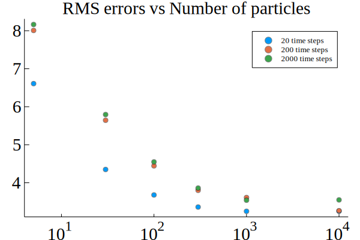

# Lecture 3

## Homework

Monte-Carlo simulation of a bootstrap particle filter

This weeks homework will be a competition. The goal is to optimize the code detailed below, the winner will be the one who has provided the fastest running program (as determined by me running on my machine `billman`) that is
1. Submitted in time.
2. *Equivalent* to the original code, in the sense that it can reproduce the estimation performance demonstrated below, without fundamentally changing the particle filter algorithm or the number of particles/time-steps.

### Details

- I provide the [baseline code](https://github.com/mfalt/juliacourse/blob/master/lecture3/test_pf.jl)
- My code provides a decent particle filter implementation
- The code is bad from a julia-performance point of view
- Your job is to optimize it
- Optimized code has to be equivalent (do not implement different algorithm)
- If you get stuck, find me in my office and I'll help you out.

### Expected results
The output of the program will look something like this
```
N = 5
N = 30
N = 100
N = 300
N = 1000
N = 10000
T = 20
N = 5
N = 30
N = 100
N = 300
N = 1000
N = 10000
T = 200
N = 5
N = 30
N = 100
N = 300
N = 1000
N = 10000
T = 2000
Propagated 359755800 particles
168.876344 seconds (926.23 M allocations: 115.608 GiB, 10.36% gc time)
```
The code took approximately 170 seconds to run on my machine and produced the following result  
  
It is a good idea to continuously test your code and make sure you maintain a similar estimation performance as you modify the code.

My optimized version runs in about  
`8.525856 seconds (1.02 M allocations: 172.929 MiB, 0.53% gc time)`  
for an approximately 20-fold reduction in running time (and a 700-fold reduction in allocated memory). This will give you an idea of *at least* how far it is possible to push it.

*-Fredrik*
